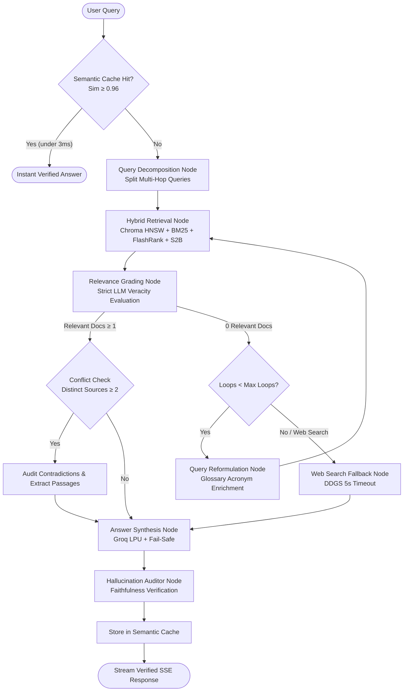

# 🏔️ Ridge · Self-Correcting RAG Intelligence Platform

<div align="center">


**Ridge** is an enterprise-grade, self-correcting Corrective Retrieval-Augmented Generation (CRAG) platform. It transforms raw technical documents, resumes, slide decks, codebases, spreadsheets, and web sources into an audited, hallucination-resistant LangGraph state machine with compound query decomposition, small-to-big parent retrieval, corpus-aware domain glossary indexing, semantic vector caching, conflict auditing, and real-time observability.

</div>

---

## 🌟 Key Architecture & Capabilities

### 1. 🔀 Compound Question Decomposition (Multi-Hop CRAG)
* **Automatic Multi-Part Detection**: Identifies complex multi-hop queries (e.g., *"Compare PEAS with DECIDE and also explain BFS"*).
* **Parallel Hybrid Retrieval**: Splits queries into 2–4 focused sub-queries, executes parallel dense (Chroma HNSW) and sparse (BM25) searches, and fuses candidates using **Reciprocal Rank Fusion (RRF, $K=60$)**.
* **Coverage Safety Valve**: If relevant document count is less than sub-queries, the router automatically triggers web search to fill the missing sub-query gaps.

---

### 2. 🔍 Small-to-Big Retrieval (SQLite Parent Document Expansion)
* **High-Precision Indexing**: Indexes compact child chunks (400 chars, 60 overlap) into ChromaDB for high-accuracy embedding cosine retrieval.
* **ACID SQLite Section Store**: Stores complete parent sections (1500 chars) in a persistent SQLite database with Write-Ahead Logging (WAL mode, `data/parent_store.db`) keyed by SHA-256 digests.
* **Generation-Time Expansion**: Automatically swaps retrieved child chunks for full parent sections with automatic de-duplication before LLM synthesis.

---

### 3. 📖 Corpus-Aware Domain Glossary & Acronym Engine
* **Automated Initialism & Entity Extraction**: Scans ingested documents for domain acronyms and full expansions (e.g. `HNSW`, `PEAS`, `CRAG`, `AZTM`) with heuristic prefix-stripping and validation.
* **Dynamic Query Expansion**: Enriches reformulated queries with contextual acronym expansions from the active document corpus during multi-hop retrieval.
* **Lifecycle & Multi-Tenant Sync**: Automatically prunes orphaned glossary entries when documents are deleted or cleared, ensuring clean per-user knowledge bases.
* **Interactive Glossary Inspector**: Inspect indexed domain terminology directly from the frontend via the top navigation bar.

---

### 4. 🧠 Semantic Chunking by Embedding Gradient
* **Embedding Gradient Detector**: Tokenizes document sentences and measures cosine similarity between consecutive sliding windows ($W=3$).
* **Self-Calibrating Percentile Boundaries**: Identifies topic shifts at the bottom 25th percentile of cosine similarity scores, eliminating arbitrary character-count cuts.
* **Coherence Optimizer**: Merges micro-chunks ($<200$ chars) and applies heading inheritance (`ensure_chunk_has_headings`) to maintain document context.

---

### 5. 📁 Source-Scoped Metadata-Filtered Retrieval
* **Scoped Search**: Choose to query across **"All Sources"** or scope strictly to specific indexed documents (e.g. `resume.pdf` or `AI Module 2.pptx`).
* **Dynamic Toolbar Selector**: Input bar dropdown automatically populated from `/api/kb/sources`.
* **Metadata WHERE Clauses**: Applies metadata filters across both Chroma dense vector search and BM25 tokenized corpora.

---

### 6. ⚡ Semantic Vector Query Cache
* **Vector Sub-Millisecond Short-Circuit**: Hashes and embeds incoming queries; if cosine similarity to a previously verified answer is $\ge 0.96$, returns the answer in $<3\text{ms}$.
* **Persistent Storage**: Verified high-confidence answers ($\text{Score} \ge 60$) are stored asynchronously in `data/query_cache.json`.
* **Visual Telemetry**: Displays `⚡ Semantic Query Cache` in the real-time ascent timeline.

---

### 7. ⚔️ Document Conflict Detection & Side-by-Side Diff Viewer
* **Contradiction Auditor**: When $\ge 2$ documents contain conflicting policies, dates, or numbers, audits discrepancies and surfaces both perspectives.
* **Interactive Diff Modal**: Clicking **"Compare Sources"** on the amber Conflict Alert Banner opens a side-by-side split comparison modal displaying source cards, text excerpts, and evaluator notes.

---

### 8. 🛡️ Multi-Tenant Authentication & Role-Based Access Control
* **Secure JWT Sessions**: Multi-tenant authentication with signed HS256 tokens and Argon2 password hashing.
* **Isolated Vector Namespaces**: Every ingested document and chunk is tagged with `user_id`, enforcing strict tenant isolation across retrieval, glossary, and document management.
* **Admin Governance**: Admin dashboard for user role promotion, system telemetry, and tenant management.

---

### 9. 📊 Automated RAG Triad Evaluation Harness
* **Automated Benchmark Suite**: [`eval/evaluate.py`](eval/evaluate.py) benchmarks test cases from [`eval/gold_dataset.json`](eval/gold_dataset.json).
* **RAG Triad Metrics**:
  1. **Context Recall**: % of gold ground-truth concepts present in retrieved documents.
  2. **Faithfulness**: Hallucination auditor verdict (`grounded == 'yes'`).
  3. **Answer Relevance**: Keyword and semantic alignment between synthesized answer and reference.
* **Report Generation**: Automatically outputs markdown scorecards to `eval/benchmark_report.md` and JSON data to `eval/results.json`.

---

### 10. 📊 Theme-Adaptive Interactive Mermaid Diagrams & KaTeX Math
* **Adaptive Mermaid SVG Diagrams**: Detects ````mermaid ... ```` code blocks in answers and dynamically renders SVG diagrams matching the active UI theme (*Stone & Summit*, *Chalk & Void*, *Rust & Ridge*).
* **Anti-Flicker In-Memory SVG Cache**: Instantaneous rendering from memory cache on re-renders, with smooth loading states and zero code flashing.
* **1-Click Visual/Source Toggle & Copy**: Inspect clean diagram source code or copy directly to clipboard.
* **KaTeX Mathematical Equations**: Full rendering support for inline `$ ... $` and display block `$$ ... $$` LaTeX equations, with automatic normalizer for bracketed formulas and Unicode whitespace normalization.
* **Zero-Latency Isolated Chat Deck**: Isolated sub-tree input deck guarantees `<0.1ms` keystroke responsiveness at 120 FPS without re-rendering markdown AST trees.

---

### 11. 📂 Universal Multi-Format Parsers & OCR
* **Images & OCR**: Direct parsing for `.png`, `.jpg`, `.jpeg`, `.webp`, `.bmp`, `.tiff` via ONNX RapidOCR.
* **Scanned PDFs**: Automatic page-image extraction and OCR fallback for flat scans.
* **Enterprise Documents**: Native support for PDF, Word (`.docx`), PowerPoint (`.pptx`), Excel (`.xlsx`), CSV/TSV, and Markdown.
* **Codebases**: Syntax-aware chunking for Python, JavaScript, TypeScript, HTML, CSS, SQL, Java, C/C++, Go, and Rust.
* **Video & Audio Transcripts**: YouTube URL transcript extraction with timestamps, plus SubRip (`.srt`) and WebVTT (`.vtt`) files.

---

## 🏗️ LangGraph State Machine Architecture



---

## 🚀 Quick Start

### 1. Prerequisites
* Python 3.11+
* Node.js 18+ and npm
* A free [Groq API Key](https://console.groq.com/)

### 2. Backend Setup
```bash
# Clone the repository
git clone https://github.com/KARTHIKKJ369/Ridge.git
cd Ridge

# Create and activate virtual environment
python3 -m venv .venv
source .venv/bin/activate

# Install dependencies
pip install -r requirements.txt

# Configure environment variables
cp .env.example .env
# Edit .env and insert your GROQ_API_KEY
```

### 3. Frontend Setup
```bash
cd frontend
npm install
npm run build
cd ..
```

### 4. Running Locally
```bash
# Start backend API (FastAPI + LangGraph)
uvicorn api:app --reload --port 8000

# In a second terminal, start Vite frontend dev server (optional for hot reload)
cd frontend
npm run dev
```
Open **`http://localhost:5173`** (or `http://localhost:8000` for the production bundle).

---

## 🧪 Running the Evaluation Benchmark

To run the automated RAG Triad evaluation suite:
```bash
source .venv/bin/activate
python eval/evaluate.py
```
This executes the gold benchmark suite and generates:
* Terminal Scorecard with Context Recall, Faithfulness, Relevance, and Latency
* Markdown report: [`eval/benchmark_report.md`](eval/benchmark_report.md)
* JSON results: `eval/results.json`

---

## ⚙️ Environment Configuration (`.env`)

| Variable | Description | Default |
|---|---|---|
| `GROQ_API_KEY` | **Required**: Groq Cloud API Key | — |
| `GROQ_MODEL` | Primary synthesis model | `openai/gpt-oss-120b` |
| `GROQ_FAST_MODEL` | Ultra-fast model for grading & decomposition | `openai/gpt-oss-20b` |
| `EMBEDDING_MODEL` | Local HuggingFace sentence transformer | `sentence-transformers/all-MiniLM-L6-v2` |
| `CHROMA_DIR` | Directory for local ChromaDB persistence | `./chroma_db` |
| `RETRIEVER_K` | Number of top documents to keep after re-ranking | `6` |
| `RETRIEVER_FETCH_K` | Candidates fetched before re-ranking | `60` |
| `RERANK_MODEL` | FlashRank re-ranking cross-encoder model | `ms-marco-MiniLM-L-12-v2` |
| `MAX_REWRITE_LOOPS` | Max query reformulation attempts | `1` |
| `AUTH_ENABLED` | Toggle user authentication and tenant isolation | `false` |
| `JWT_SECRET_KEY` | Secret key for signed JWT session tokens | `ridge_crag_secret_key` |
| `DATA_DIR` | Directory for parent SQLite store and query cache | `./data` |

---

## 📁 Repository Structure

```
Ridge/
├── main.py                # Core LangGraph state machine & CRAG pipeline
├── api.py                 # FastAPI backend & SSE streaming endpoints
├── auth.py                # JWT authentication, Argon2 hashing & user DB
├── rag_ingest.py          # Document parsers, OCR, & semantic gradient chunking
├── parent_store.py        # Small-to-Big SQLite WAL parent section registry
├── query_cache.py         # Semantic vector query cache (cosine sim >= 0.96)
├── glossary.py            # Corpus-aware acronym & entity glossary engine
├── retriever.py           # Hybrid dense + sparse search wrappers
├── requirements.txt       # Python backend dependencies
├── pyproject.toml         # Project metadata & dependencies
├── eval/
│   ├── evaluate.py        # Automated RAG Triad evaluation harness
│   ├── gold_dataset.json  # Benchmark ground-truth test cases
│   └── benchmark_report.md# Latest benchmark run scorecard
├── data/                  # Runtime persistence directory (git-ignored)
│   ├── parent_store.db    # SQLite parent section database
│   ├── query_cache.json   # Semantic vector query cache
│   └── glossary.json      # Indexed domain terminology & acronyms
├── scripts/               # Administrative & diagnostic CLI utilities
│   ├── create_admin.py    # Admin user creation helper
│   ├── inspect_chroma.py  # ChromaDB inspection utility
│   └── inspect_chunking.py# Chunk boundary diagnostic tool
└── frontend/              # Alpine 2026 React 19 + TypeScript + Vite UI
    ├── src/
    │   ├── App.tsx        # Main application component & state machine
    │   ├── App.css        # Design system tokens & CSS styling
    │   └── components/    # AuthModal and auxiliary UI components
    └── package.json       # Frontend npm dependencies
```

---

## 📄 License
MIT License. Built with ❤️ for enterprise-grade, hallucination-resistant research.
