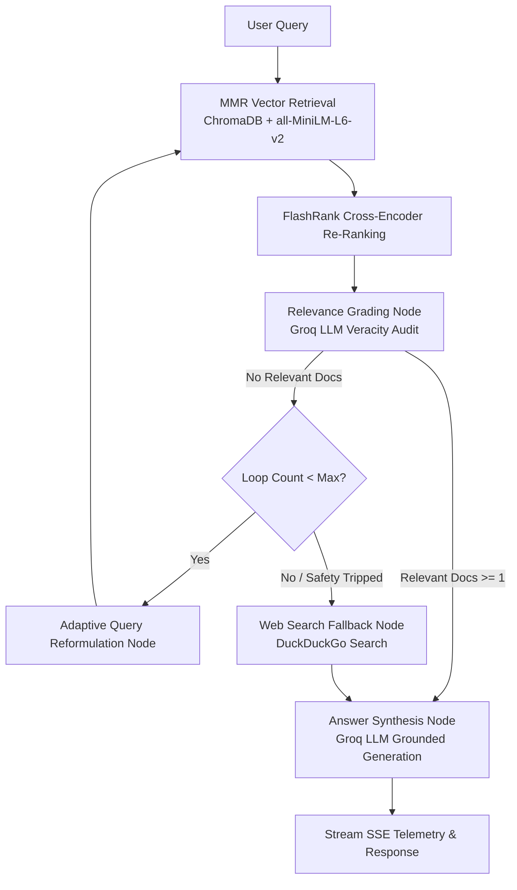

# Ridge · Corrective RAG Intelligence System

**Ridge** is a high-performance Corrective Retrieval-Augmented Generation (CRAG) intelligence platform. It ingests custom technical documentation (PDF, Markdown, or plain text) and web sources into a self-correcting LangGraph state machine that retrieves, re-ranks, audits for veracity, adaptively reformulates queries, and synthesizes grounded answers with zero hallucination.

---

## 🌟 Key Features

### 1. Corrective RAG State Machine (LangGraph)
- **MMR Diversity Retrieval**: Deep vector retrieval via ChromaDB with Maximal Marginal Relevance to prevent redundancy.
- **Cross-Encoder Re-Ranking**: Integrated FlashRank cross-encoder to re-order candidate passages by semantic alignment.
- **Relevance Grading & Hallucination Filter**: Groq LLM evaluates retrieved passages with structured rationales, filtering out keyword false positives.
- **Adaptive Query Reformulation**: Context-aware search reformulation anchored to the original user intent.
- **Dynamic Web Fallback**: Seamless fallback to DuckDuckGo search when local document recall is low.
- **Grounded Answer Synthesis**: Generates detailed, insightful explanations and code examples derived from verified context.

### 2. Modern 2026 Alpine UI (React + Vite + TypeScript)
- **Climbing-Inspired Themes**:
  - **Stone & Summit** (Default): Warm sandstone off-white topo aesthetic with summit blue accents.
  - **Chalk & Void**: Basalt granite dark mode with glacier cyan highlights.
  - **Rust & Ridge**: Desert crag earth with terracotta and moss green tones.
- **Real-Time Pipeline Trace**: Side-by-side observability drawer displaying every node step, latency, and relevance rationale.
- **Knowledge Crag Management**: Drag-and-drop document upload (PDF, TXT, MD) and live URL scraping.
- **Multi-Session Workspaces**: Create, switch, and export research ascents in Markdown or JSON format.
- **Instant Hero Hydration**: Persistent suggestion caching (`suggestions.json` + `localStorage`) for 0ms initial load.
- **Tactile Studio Input Deck**: Command palette with quick prompts (`/`), document attachment, and live web fallback toggle.

---

## 🏗️ System Architecture



---

## ⚙️ Environment Configuration

Create a `.env` file in the project root:

```env
# Required: Groq Cloud API Key
GROQ_API_KEY=gsk_your_groq_api_key_here

# Optional: LLM Models
GROQ_MODEL=llama-3.3-70b-versatile
EMBEDDING_MODEL=sentence-transformers/all-MiniLM-L6-v2

# Optional: Vector Store & Retrieval Settings
CHROMA_DIR=./chroma_db
RETRIEVER_K=5
RETRIEVER_FETCH_K=50
RETRIEVER_LAMBDA_MULT=0.5
MAX_REWRITE_LOOPS=2

# Optional: Authentication & JWT Security (Local Accounts)
AUTH_ENABLED=true
JWT_SECRET=your_super_secret_jwt_key_here
AUTH_DB_PATH=./users.db
```

---

## 🚀 Quickstart & Local Development

### Prerequisites
- Python 3.11+ (managed via `uv` or `pip`)
- Node.js 18+ and `npm`

### 1. Backend Setup

```bash
# Clone the repository
git clone https://github.com/KARTHIKKJ369/corrective-rag-langgraph.git
cd corrective-rag-langgraph

# Install dependencies using uv
uv sync

# Run the FastAPI server
uv run uvicorn api:app --reload --port 8000
```

### 2. Frontend Setup

```bash
cd frontend

# Install dependencies
npm install

# Run the Vite development server (Proxies /api, /ask, /ingest to port 8000)
npm run dev

# Or build the production distribution bundle
npm run build
```

The application will be accessible at:
- **Frontend UI**: `http://localhost:5173` (or `http://localhost:8000` when served via FastAPI static mount)
- **API Documentation (Swagger)**: `http://localhost:8000/docs`

---

## 📂 Project Structure

```
corrective-rag-langgraph/
├── api.py                   # FastAPI backend with SSE streaming endpoints
├── main.py                  # LangGraph state machine, nodes, and LLM configuration
├── rag_ingest.py            # Document loading, chunking, and ChromaDB vector store
├── suggestions.json         # Persistent query suggestions cache
├── requirements.txt         # Python dependencies
├── frontend/                # React + Vite + TypeScript frontend
│   ├── src/
│   │   ├── App.tsx          # Main workspace, chat stream, and panel drawer
│   │   ├── App.css          # Alpine intelligence styles and bento layouts
│   │   ├── index.css        # Climbing design tokens (Stone, Void, Rust)
│   │   └── main.tsx         # Application entry point
│   ├── public/
│   │   └── favicon.svg      # Symmetrical mountain summit vector emblem
│   ├── package.json         # Frontend dependencies and build scripts
│   └── vite.config.ts       # Vite build config and backend API proxy
└── README.md                # Project documentation
```

---

## 🛠️ Tech Stack

- **Orchestration**: LangGraph, LangChain Core
- **LLM Engine**: Groq Cloud (`llama-3.3-70b-versatile`, `llama-3.1-8b-instant`)
- **Vector Embeddings**: HuggingFace `sentence-transformers/all-MiniLM-L6-v2` (Local CPU/MPS)
- **Vector Database**: ChromaDB
- **Re-Ranking**: FlashRank Cross-Encoder
- **Web Search**: DuckDuckGo Search API
- **API Server**: FastAPI, Uvicorn, Server-Sent Events (SSE)
- **Frontend**: React 19, TypeScript, Vite, Lucide Icons, React Markdown

---

## 📄 License

MIT License. Open source and free to build upon.
