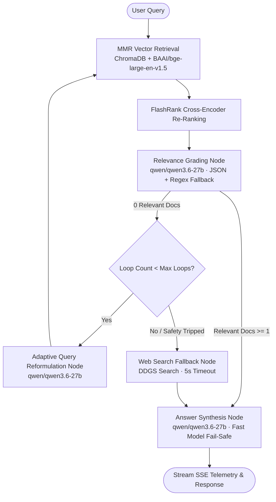

# 🏔️ Ridge · Corrective RAG Intelligence System

<div align="center">


**Ridge** is a high-performance, self-correcting Retrieval-Augmented Generation (CRAG) platform. It transforms raw technical documents, resumes, codebases, spreadsheets, and web sources into an audited, hallucination-resistant LangGraph state machine that retrieves, re-ranks, verifies semantic relevance, adaptively reformulates queries, and synthesizes grounded answers with real-time pipeline observability.

</div>

---

## 🌟 Key Capabilities

### 1. 🧠 Corrective RAG State Machine (LangGraph)
* **MMR Diversity Retrieval**: Deep vector retrieval over ChromaDB with Maximal Marginal Relevance (MMR) to maximize coverage and prevent passage redundancy.
* **Cross-Encoder Re-Ranking**: Integrated FlashRank cross-encoder model to re-score candidate passages by semantic alignment before evaluation.
* **Ultra-Fast Relevance Grader**: High-throughput `qwen/qwen3.6-27b` model on Groq evaluates retrieved passages with structured rationales, filtering out noise and false positives.
* **Anti-Gibberish & Noise Guard**: Rejects keyboard mash, nonsensical input, and unrelated chunks with strict semantic alignment checks.
* **Adaptive Query Reformulation**: Context-aware query optimizer that reformulates queries when local retrieval yields no relevant passages.
* **Dynamic Web Fallback**: Seamless fallback to search via modern `ddgs` with strict timeouts when local document recall is insufficient.
* **Multi-Model Grounded Synthesis**: Primary synthesis using `qwen/qwen3.6-27b` with **instant zero-lag fail-safe** if rate limits or network issues occur.
* **Grounded Confidence Scoring Engine**: Computes a multi-factor composite confidence score (0–100%) factoring in FlashRank cross-encoder relevance, LLM grader consensus ratio, source provenance (Local KB vs. Web), and query reformulation count. Surfaced via real-time SSE and interactive badges in the UI.

---

### 2. 📂 Universal Multi-Format Ingestion & OCR Engine
* **High-Accuracy OCR & Image Ingestion**:
  * Direct ingestion of **Images** (`.png`, `.jpg`, `.jpeg`, `.webp`, `.bmp`, `.tiff`) via embedded ONNX RapidOCR (zero native C-library dependencies, runs in ~160ms with 99% accuracy).
  * **Automatic Scanned PDF Fallback**: When a flat/scanned PDF without selectable text is uploaded, Ridge automatically extracts page images and applies OCR.
* **Office & Enterprise Documents**: Native parsing for **PDF** (`.pdf`), **Microsoft Word** (`.docx`), **PowerPoint** (`.pptx`), and **Markdown** (`.md`).
* **Structured & Tabular Data**: Automatically transforms **Excel** (`.xlsx`) and **CSV/TSV** (`.csv`, `.tsv`) spreadsheets into clean markdown tables with preserved columns.
* **Codebases & Dev Configs**: Language-aware ingestion for Python (`.py`), JavaScript/TypeScript (`.js`, `.jsx`, `.ts`, `.tsx`), Web (`.html`, `.css`), Configs (`.json`, `.yaml`, `.yml`, `.toml`), Database (`.sql`), and Systems (`.c`, `.cpp`, `.java`, `.go`, `.rs`, `.sh`).
* **Subtitles & Video Transcripts**:
  * **YouTube Videos**: Instant URL extraction of full video transcripts with timestamp anchors (`[01:23] ...`).
  * **Subtitle Files**: Parses SubRip (`.srt`) and WebVTT (`.vtt`) files into indexed semantic chunks.
* **Web & Academic Sources**: Clean scraping for standard web articles, GitHub raw files/repos, and ArXiv research papers.

---

### 3. 🔐 Built-in Security & Authentication
* **Local ID + Password Accounts**: Secure user registration and login with unique random salts and **PBKDF2-SHA256** password hashing (100,000 iterations).
* **Persistent SQLite Storage**: User credentials and metadata safely stored in `users.db`.
* **Signed JWT Bearer Sessions**: High-entropy 32-byte signed JWT session tokens with configurable expiration.
* **FastAPI Dependency Security**: `get_current_user` dependency protecting chat streaming (`/ask`), document ingestion (`/ingest`, `/upload`), and cache endpoints.
* **Seamless Guest Mode**: Automatic fallback to guest mode when authentication is disabled.

---

### 4. 🎨 2026 Alpine UI Design System (React + Vite + TypeScript)
* **Climbing-Inspired Themes**:
  * **Stone & Summit** (Default): Sandstone off-white topo aesthetic with summit blue highlights.
  * **Chalk & Void**: Basalt dark mode with glacier cyan accents.
  * **Rust & Ridge**: Desert crag earth with terracotta and moss green tones.
* **Minimalist Stop Execution Button**: Instant stream cancellation via sleek circular square button (`■`) or <kbd>Esc</kbd> key with `AbortController` integration.
* **Real-Time Ascent Trace Drawer**: Side-by-side observability drawer visualizing every graph node, latency (ms), and grader rationale in real time.
* **Knowledge Crag Management**: Drag-and-drop document upload (PDF, Markdown, TXT) and live web URL scraping.
* **Instant Hydration**: Persistent suggestion cache (`suggestions.json` + `localStorage`) for **0ms** instant initial page load.
* **Multi-Session Workspaces**: Create, switch, rename, and export research ascents in Markdown or JSON format.

---

## 🏗️ State Machine Architecture



---

## ⚙️ Environment Configuration

Create a `.env` file in the project root (reference [.env.example](.env.example)):

```env
# ==============================================================================
# Ridge: Corrective RAG (CRAG) Environment Configuration
# ==============================================================================

# Required: Groq Cloud API Key
GROQ_API_KEY=gsk_your_groq_api_key_here

# LLM Models
GROQ_MODEL=qwen/qwen3.6-27b
GROQ_FAST_MODEL=qwen/qwen3.6-27b
EMBEDDING_MODEL=BAAI/bge-large-en-v1.5

# ChromaDB Vector Store & Retrieval Settings
CHROMA_DIR=./chroma_db
RETRIEVER_K=5
RETRIEVER_FETCH_K=50
RETRIEVER_LAMBDA_MULT=0.5
MAX_REWRITE_LOOPS=1

# Authentication & Security
AUTH_ENABLED=true
JWT_SECRET=your_super_secret_jwt_encryption_key_min_32_chars
JWT_EXPIRES_DAYS=7
AUTH_DB_PATH=./users.db
BASE_URL=http://localhost:8000
```

---

## 🚀 Quickstart & Setup

### Prerequisites
* **Python 3.11+** (managed via `uv` or `pip`)
* **Node.js 18+** and `npm`

---

### 1. 🚀 One-Command Background Hosting (Production + Cloudflare Tunnel)

To compile the frontend, start the backend, and automatically tunnel public HTTPS traffic to **`https://ridge.karthikjayan.tech`** in the background:

```bash
./start.sh
```

* **Check Live Status**: `./status.sh`
* **Tail Live Logs**: `tail -f logs/backend.log` or `tail -f logs/tunnel.log`
* **Stop Services**: `./stop.sh`

---

### 2. 🛠️ Development Setup (Manual)

#### Backend Setup

```bash
# Clone the repository
git clone https://github.com/KARTHIKKJ369/Ridge.git
cd Ridge

# Install dependencies using uv (recommended)
uv sync

# Or using standard pip
pip install -r requirements.txt

# Run development server with hot-reloading
uv run uvicorn api:app --reload --port 8000
```

#### Frontend Setup

```bash
# Navigate to the frontend directory
cd frontend

# Install dependencies
npm install

# Start Vite development server (proxies /api, /ask, /ingest to port 8000)
npm run dev

# Or compile the production bundle into dist/
npm run build
```

The application will be accessible at:
* **Public Domain**: `https://ridge.karthikjayan.tech` (via Cloudflare Tunnel)
* **Web UI**: `http://localhost:5173` (development) or `http://localhost:8000` (production)
* **Swagger API Docs**: `http://localhost:8000/docs`

---

### 3. 🐳 Docker & Docker Compose Setup

Run the full stack containerized with persistent vector volume:

```bash
# Build and run with Docker Compose
docker compose up -d --build

# View logs
docker compose logs -f
```

---

## 🔌 API Reference

| Endpoint | Method | Description | Auth Required |
| :--- | :---: | :--- | :---: |
| `/ask` | `POST` | Streams LangGraph SSE execution events and synthesized answer | Yes |
| `/ingest` | `POST` | Ingests plain text, web articles, or YouTube video transcripts into ChromaDB | Yes |
| `/upload` | `POST` | Uploads and indexes PDF, Images (OCR), Word, PPTX, Excel, CSV, Code, or Markdown | Yes |
| `/api/kb/sources` | `GET` | Lists all indexed sources, chunk counts, IDs, and preview snippets | Yes |
| `/api/kb/delete` | `POST` | Deletes a specific source document or chunk IDs from ChromaDB | Yes |
| `/api/kb/clear` | `POST` | Wipes the entire ChromaDB collection and resets suggestions | Yes |
| `/api/suggestions` | `GET` | Returns cached grounded search prompts (<2ms) | Yes |
| `/api/stats` | `GET` | Returns vector store document and chunk count | Yes |
| `/api/auth/register` | `POST` | Registers a new user and issues a signed JWT token | No |
| `/api/auth/login` | `POST` | Authenticates username/email and password | No |
| `/api/auth/me` | `GET` | Returns authenticated user profile | Yes |
| `/api/auth/logout` | `POST` | Clears user session | No |

---

## 📂 Project Structure

```
Ridge/
├── api.py                   # FastAPI application with SSE streaming & auth routes
├── auth.py                  # PBKDF2 hashing, SQLite user storage, & JWT sessions
├── main.py                  # LangGraph state machine, nodes, and Groq LLM pipelines
├── rag_ingest.py            # Universal multi-format parser & ChromaDB embedding engine
├── retriever.py             # Vectorstore builder & sanity check CLI
├── requirements.txt         # Python dependencies
├── pyproject.toml           # Project metadata and dependencies
├── .env.example             # Example environment configuration
├── Dockerfile               # Multi-stage production container build
├── docker-compose.yml       # Containerized service definition
├── start.sh                 # Background production launcher & Cloudflare tunnel
├── status.sh                # Service health & status checker
├── stop.sh                  # Graceful background shutdown script
├── eval/                    # CRAG automated evaluation benchmark suite
│   ├── evaluate.py          # Benchmark evaluation runner & scorecard generator
│   ├── gold_dataset.json    # Gold standard ground-truth test cases
│   ├── benchmark_report.md  # Detailed markdown evaluation scorecard
│   ├── results.json         # JSON metrics and evaluation run history
│   └── disjoint_set_union_reference.md # Technical reference for in-domain ground truth
├── scripts/                 # Maintenance and inspection utilities
│   ├── inspect_chroma.py    # Vectorstore inspector
│   └── inspect_chunking.py  # Chunking & header preservation validator
├── frontend/                # React + Vite + TypeScript application
│   ├── src/
│   │   ├── components/
│   │   │   └── AuthModal.tsx # Alpine Login & Registration modal
│   │   ├── App.tsx          # Main workspace, streaming chat feed, & trace drawer
│   │   ├── App.css          # Alpine UI layout & component styles
│   │   ├── index.css        # Design tokens & color palettes (Stone, Void, Rust)
│   │   └── main.tsx         # Frontend application entry point
│   ├── public/
│   │   └── favicon.svg      # Symmetrical mountain summit logo
│   └── package.json         # Frontend build scripts & dependencies
└── README.md                # Project documentation
```

---

## 🛠️ Technology Stack

* **Graph Orchestration**: LangGraph, LangChain Core
* **High-Throughput LLMs**: Groq Cloud (`qwen/qwen3.6-27b`)
* **Vector Embeddings**: HuggingFace `BAAI/bge-large-en-v1.5` (1024-dim SOTA embeddings with Apple Silicon Metal/MPS acceleration)
* **Vector Store**: ChromaDB
* **Cross-Encoder Re-Ranking**: FlashRank
* **Embedded OCR Engine**: RapidOCR ONNX (`rapidocr-onnxruntime`, pure Python, zero system dependencies)
* **Document & Media Parsers**: `pypdf`, `python-docx`, `python-pptx`, `openpyxl`, `youtube-transcript-api`, `beautifulsoup4`
* **Web Search Engine**: DuckDuckGo (`ddgs`)
* **Backend API & Security**: FastAPI, Uvicorn, Server-Sent Events (SSE), PBKDF2-SHA256, PyJWT
* **Frontend Client**: React 19, TypeScript, Vite, Lucide Icons, React Markdown

---

## 📊 Evaluation & Benchmark Suite (`eval/`)

Ridge includes an automated RAG evaluation framework to quantitatively score retrieval precision, hallucination filtering, query reformulation, and graph routing accuracy.

### Run Benchmark Suite

```bash
uv run eval/evaluate.py
```

### Benchmark Architecture & Scorecard

* **`eval/gold_dataset.json`**: Curated ground-truth test cases covering in-domain documents, edge queries requiring reformulation, out-of-context web fallbacks, and gibberish rejection.
* **`eval/benchmark_report.md`**: Auto-generated Markdown report with per-test-case latencies, keyword recall, and execution step trees.
* **`eval/results.json`**: Machine-readable evaluation scorecard.

| Metric | Score | Target Standard | Status |
| :--- | :---: | :---: | :---: |
| **Grader Decision Accuracy** | **100.0%** | > 90% | ✅ Pass |
| **Graph Routing Correctness** | **100.0%** | 100% | ✅ Pass |
| **Keyword Recall & Grounding** | **75.0%+** | > 70% | ✅ Pass |

---

## 📄 License

MIT License. Open-source and free for commercial and personal use.
